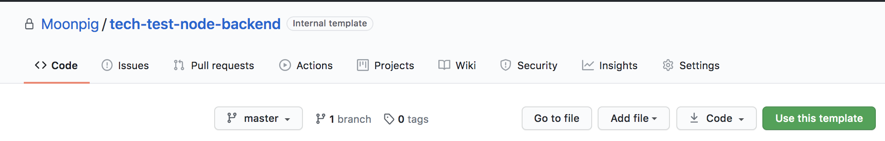
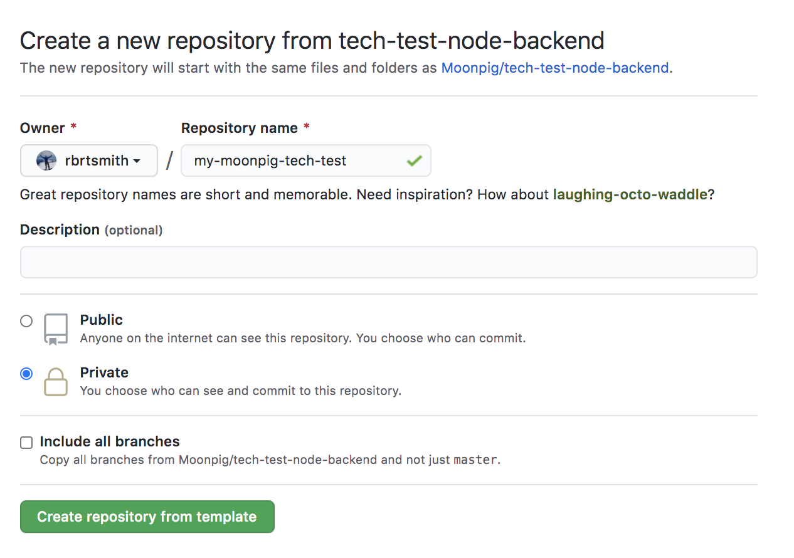
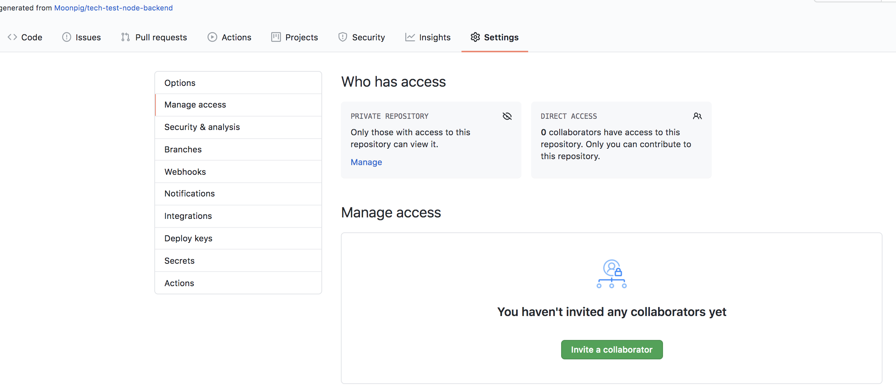

# Node Backend Technical Challenge

You've been tasked with building a new "cards" service for the front-end of the Moonpig website. This exercise requires building a simple REST-like API with two endpoints - one for returning a list of cards and another which returns a single card instance.

We have provided three JSON files in `/data` that serve as source data (imagine in a real system this file-based data would be replaced with database or remote API call).

## Endpoints

### `/cards`

This endpoint returns a list of cards.
- `backgroundImageUrl` should be the front-cover image found on the corresponding page template.
- `url` should have the format `/cards/[id]`

Expected JSON output when hitting `/cards`:
```json
[
  {
    "title": "card 1 title",
    "backgroundImageUrl": "/front-cover-portrait-1.jpg",
    "url": "/cards/card001"
  },
  {
    "title": "card 2 title",
    "backgroundImageUrl": "/front-cover-portrait-2.jpg",
    "url": "/cards/card002"
  },
  {
    "title": "card 3 title",
    "backgroundImageUrl": "/front-cover-landscape.jpg",
    "url": "/cards/card003"
  }
]
```

### `/cards/[cardId]/[sizeId]`

This endpoint returns a single card by it's `id`. It takes an optional route parameter `sizeId` - the sizing of a card affects its price.

- `price` is calculated by the multiplying the `basePrice` of the card by the `priceMultiplier` from the selected size. If no size is provided it should default to the `basePrice`.

Expected JSON output when hitting `/cards/card001/gt`:
```json
{
  "title": "card 1 title",
  "size": "gt",
  "availableSizes": [
    {
      "id": "sm",
      "title": "Small"
    },
    {
      "id": "md",
      "title": "Medium"
    },
    {
      "id": "gt",
      "title": "Giant"
    }
  ],
  "backgroundImageUrl": "/front-cover-portrait-1.jpg",
  "price": "£4.00",
  "pages": [
    {
      "title": "Front Cover",
      "width": 300,
      "height": 600,
      "backgroundImageUrl": "/front-cover-portrait-1.jpg"
    },
    {
      "title": "Inside Left",
      "width": 300,
      "height": 600,
      "backgroundImageUrl": ""
    },
    {
      "title": "Inside Right",
      "width": 300,
      "height": 600,
      "backgroundImageUrl": ""
    },
    {
      "title": "Back Cover",
      "width": 300,
      "height": 600,
      "backgroundImageUrl": "/back-cover-portrait.jpg"
    }
  ]
}
```

## Tools, Libraries and frameworks

An app skeleton is provided for your convenience. It consists of the following tools:

- Express
- Jest for unit/integration testing
- Supertest for integration tests
- TypeScript - If you're not familiar with TypeScript you can use JavaScript instead.

## Scripts

| Command | Description |
|--|--|
| `yarn dev` | run the server in development (watch) mode on port 7000 |
| `yarn test` |  run tests using Jest watch mode |


## Assessment

We will assess the task based on the following criteria:

- How clean, modular and extensible the code is
- Considerations for performance
- Approach to testing
- Knowledge of Node and it's APIs

## Notes

We have provided a notes file `NOTES.md` for any notes that you wish to add that could help your application such as explaining why you've made certain decisions.

Please note we appreciate that your free time is important and feel that doing less "well" is preferable to doing more "less well".  With this in mind if you feel that your code is unfinished please leave some notes explaining what you'd do given more time.  We'll be more than happy to review this.

## Get Started

Please follow the steps below to setup a private copy of this repository that you can iterate on and then submit to us. 

1. Click on the green "Use this template" button on this repository
  
2. In the Owner dropdown select your personal GitHub account and provide a name for the repository.
3. Set the repository visibility to "Private" and click on the green "Create repository from template" button.
  
4. On your new repository click on the "Settings Tab" -> "Manage Access" then click on The green "Invite collaborator" button
  
5. In the popup please add the following collaborators `willbamford`, `rbrtsmith`, `mmmurray` to enable us to review your submission.
6. The repository should now be setup for you to clone down to your machine.